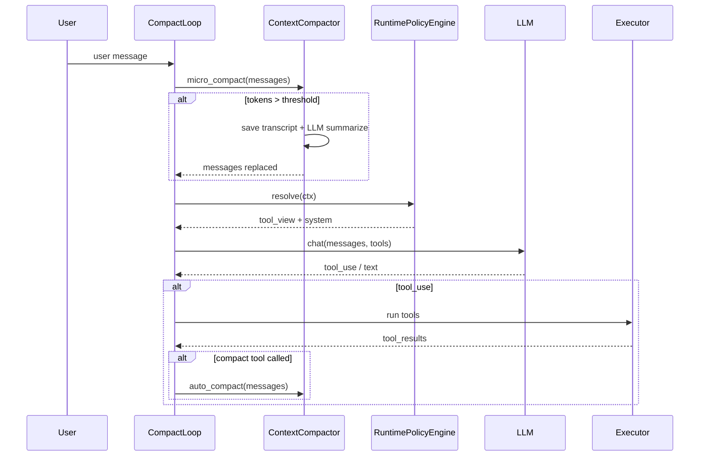

@old/s06_context_compact.py 我想将这部分context compact的实现加入到现在的agent系统中，说明步骤和方案（包含需要写什么文件，放到哪个目录，实现什么功能，整体思路，步骤等）。只给方案，不要动代码。

# Context Compact 集成方案

基于 `old/s06_context_compact.py` 的三层压缩机制，以及当前 agent 的四层架构（Plugin → Runtime → Orchestrator → Execution），下面是一套**只谈设计、不改代码**的接入方案。

---

## 一、旧实现要迁移什么

`s06` 的核心是三层压缩流水线：

| 层级 | 名称 | 触发时机 | 行为 |
|------|------|----------|------|
| Layer 1 | `micro_compact` | 每轮 LLM 调用前 | 将较早的 `tool_result` 替换为 `[Previous: used {tool_name}]`，保留最近 3 条；`read_file` 结果不压缩 |
| Layer 2 | `auto_compact` | token 估算超过阈值 | 全量 transcript 落盘 → LLM 摘要 → `messages` 原地替换为一条 summary |
| Layer 3 | `compact` tool | 模型主动调用 | 与 Layer 2 相同，但由模型触发 |

关键设计点：

- 压缩的是 **messages 列表**，不是 system prompt
- `compact` 工具**不能**在 tool handler 里直接改 `messages`（旧代码注释已指出），应在 **agent loop** 里做后处理
- `read_file` 作为「source of truth」需保留，避免反复重读

---

## 二、与当前架构的映射

当前链路：

```
PluginManager → ToolRegistry
     ↓
RuntimePolicyEngine.resolve(ctx)  →  ToolView + system_prompt
     ↓
BaseLoop.loop(messages)  →  agent.run → executor.run
```

架构约束（见 `src/plugins/plugins.md`）：

- **Plugin**：只做静态注册，不碰 loop
- **Runtime**：决定工具可见性、system prompt
- **Orchestrator（BaseLoop）**：纯循环，不做权限/策略
- **Execution**：工具执行与 subagent 路由

因此压缩逻辑**不应**放进 Plugin 或 Execution，而应：

1. **核心算法** → 独立 service 模块（建议 `src/memory/`）
2. **调用时机** → Orchestrator 层 hook（类似已有的 `SweBenchLoop` 子类模式）
3. **`compact` 工具** → Plugin 注册，但**真正压缩**在 loop 后处理

```
┌─────────────────────────────────────────────────────────┐
│  CompactLoop (extends BaseLoop)                         │
│                                                         │
│  每轮开始:                                               │
│    1. micro_compact(messages)                           │
│    2. if tokens > threshold: auto_compact(messages)     │
│    3. runtime.resolve(ctx) → LLM call                   │
│                                                         │
│  工具执行后:                                             │
│    4. if compact tool called: auto_compact(messages)    │
└─────────────────────────────────────────────────────────┘
         ↑ 调用
┌─────────────────────────────────────────────────────────┐
│  ContextCompactor (src/memory/context_compactor.py)     │
│  - estimate_tokens()                                    │
│  - micro_compact()                                      │
│  - auto_compact() → save transcript + LLM summarize   │
└─────────────────────────────────────────────────────────┘
```

---

## 三、需要新增/修改的文件

### 3.1 新增文件

| 文件 | 目录 | 职责 |
|------|------|------|
| `context_compactor.py` | `src/memory/` | 三层压缩核心逻辑 + `CompactionConfig` dataclass |
| `compact.py` | `src/tools/` | `Compact` 工具（`BaseTool` 子类），仅返回占位文案，标记「请求压缩」 |
| `context_compact_plugin.py` | `src/plugins/` | 可选插件，注册 `compact` 工具 |
| `compact_loop.py` | `src/orchestrator/` | `CompactLoop(BaseLoop)`，在合适时机调用 `ContextCompactor` |

### 3.2 修改文件

| 文件 | 改动 |
|------|------|
| `src/config/agent_config.json` | 增加 `plugins.context_compact` 配置块 |
| `src/config/loader.py` | 可选：支持 `CONTEXT_COMPACT_ENABLED`、`COMPACT_THRESHOLD` 等环境变量 |
| `src/plugins/manager.py` | 在 `OPTIONAL_PLUGINS` 注册 `context_compact` |
| `src/setup.py` | 创建 `ContextCompactor`，按配置选择 `CompactLoop` 或 `BaseLoop` |
| `src/runtime/context.py` | 可选：增加 `compact_requested: bool` 等运行时标记 |
| `src/plugins/plugins.md` | 文档补充 context compact 扩展说明 |

### 3.3 可选 / 后续

| 文件 | 说明 |
|------|------|
| `tests/test_context_compactor.py` | 单元测试（micro / auto / preserve read_file） |
| `src/evaluation/agent_loop.py` | SWE-bench 场景是否启用、阈值如何设 |
| `src/runtime/subagent_loop.py` | 子 agent 是否只做 micro、不做 auto |

---

## 四、各模块设计细节

### 4.1 `src/memory/context_compactor.py`（核心）

从 `s06` 迁移并适配当前消息格式（assistant content 已是 `model_dump()` 的 dict 列表，不再是 Anthropic SDK 对象）。

建议包含：

```python
@dataclass
class CompactionConfig:
    enabled: bool = True
    token_threshold: int = 50_000      # auto_compact 阈值
    keep_recent_tool_results: int = 3
    preserve_tools: frozenset = frozenset({"read_file"})
    min_content_length: int = 100    # 太短的不替换
    transcript_dir: Path | None = None  # 默认 workdir/.transcripts
    summary_max_tokens: int = 2000

class ContextCompactor:
    def __init__(self, agent: BaseAgent, config: CompactionConfig, log_session=None)
    def estimate_tokens(messages) -> int
    def micro_compact(messages) -> list      # 原地修改
    def auto_compact(messages) -> list       # 落盘 + 摘要 + 原地替换
```

与旧实现的差异：

- **LLM 调用**：通过注入的 `BaseAgent` / `AnthropicClient`，不直接 `client.messages.create`
- **Transcript 存储**：
  - 方案 A（推荐）：`workdir/.transcripts/transcript_{ts}.jsonl`，与旧行为一致
  - 方案 B：复用 `LogSession`，在 `events.jsonl` 旁写 `compact_{ts}.jsonl`
- **tool_name 解析**：遍历 assistant 消息里 `type == "tool_use"` 的 block，建立 `tool_use_id → name` 映射（适配 dict 格式）

### 4.2 `src/tools/compact.py`（工具声明）

```python
class Compact(BaseTool):
    name = "compact"
    description = "Trigger manual conversation compression when context is too long."
    input_schema = {
        "type": "object",
        "properties": {
            "focus": {"type": "string", "description": "What to preserve in the summary"}
        }
    }
    def run(self, **kwargs) -> str:
        return "Compression requested. Summarizing conversation..."
```

工具只负责**信号**；`focus` 可传入 summarization prompt（Layer 3 增强点）。

### 4.3 `src/orchestrator/compact_loop.py`（集成点）

参考 `SweBenchLoop` 的子类模式，在 `loop()` 里加 hook：

```python
class CompactLoop(BaseLoop):
    def __init__(self, ..., compactor: ContextCompactor):
        super().__init__(...)
        self.compactor = compactor

    def loop(self, messages, logger=None, max_rounds=None):
        # 每轮 LLM 调用前
        if self.compactor.config.enabled:
            self.compactor.micro_compact(messages)
            if self.compactor.should_auto_compact(messages):
                self.compactor.auto_compact(messages)
                log compaction event

        # ... 原有 resolve → agent.run → executor 逻辑 ...

        # 工具执行后
        if compact_tool_was_called:
            self.compactor.auto_compact(messages, focus=...)
            return  # 或 continue，取决于产品行为
```

**`compact` 检测方式**（二选一）：

- 遍历本轮 `tool_use` blocks，若 `name == "compact"` 则标记
- 或在 `RuntimeContext` 加 `compact_requested`（更干净）

旧代码在 manual compact 后会 `return` 结束本轮；需产品决策：是结束当前 turn，还是继续 loop。

### 4.4 `src/plugins/context_compact_plugin.py`

```python
class ContextCompactPlugin(Plugin):
    name = "context_compact"
    def register(self, registry, plugin_config):
        if plugin_config.get("enabled", True):
            registry.add_tool(Compact)
```

### 4.5 配置 `agent_config.json`

```json
{
  "plugins": {
    "context_compact": {
      "enabled": true,
      "token_threshold": 50000,
      "keep_recent_tool_results": 3,
      "preserve_tools": ["read_file"],
      "register_compact_tool": true
    }
  }
}
```

环境变量示例：

- `CONTEXT_COMPACT_ENABLED=false` — 评测时关闭
- `COMPACT_THRESHOLD=5000` — 调试时降低阈值

### 4.6 `src/setup.py` 接线

```python
# 伪代码
compactor = None
loop_cls = BaseLoop
if config.get("plugins", {}).get("context_compact", {}).get("enabled"):
    compactor = ContextCompactor(agent, CompactionConfig.from_config(config), log_session)
    loop_cls = CompactLoop

main_loop = loop_cls(agent=agent, runtime=runtime, executor=executor, compactor=compactor)
```

---

## 五、实施步骤（推荐顺序）

### Phase 1：核心逻辑（无 loop 集成）

1. 新建 `src/memory/context_compactor.py`
2. 从 `s06` 迁移 `estimate_tokens`、`micro_compact`、`auto_compact`
3. 适配 dict 格式 messages（assistant `tool_use`、user `tool_result`）
4. 写单元测试：micro 保留 read_file、auto 替换为 summary、transcript 落盘

### Phase 2：Loop 集成

5. 新建 `src/orchestrator/compact_loop.py`
6. 在 LLM 调用前挂 Layer 1 + Layer 2
7. 在工具执行后挂 Layer 3（检测 `compact` 调用）
8. 修改 `setup.py`，按配置实例化 `CompactLoop`

### Phase 3：工具与配置

9. 新建 `src/tools/compact.py`
10. 新建 `src/plugins/context_compact_plugin.py`
11. 更新 `manager.py`、`agent_config.json`、`loader.py`
12. CLI 手动验证：长会话触发 auto_compact、模型调 `compact` 触发 manual

### Phase 4：边界场景

13. **Subagent**：默认不注册 `compact`；可选对 `SubAgentLoop` 只做 `micro_compact`
14. **SWE-bench**：`SweBenchLoop` 继承 `CompactLoop` 或组合 compactor；评测建议默认关闭 auto（`max_rounds` 有限）
15. **日志**：compaction 事件写入 `LogSession.events`（`scope: "compact"`）
16. 更新 `plugins.md`

---

## 六、架构边界与注意事项

### 6.1 放在哪一层

| 能力 | 归属 | 原因 |
|------|------|------|
| 压缩算法 | `src/memory/` | 与 `todo_manager` 同属会话状态管理 |
| 调用时机 | `src/orchestrator/` | 需在每轮 LLM 前后操作 `messages` |
| `compact` 工具注册 | `src/plugins/` | 符合现有工具扩展方式 |
| 工具可见性 | `src/runtime/resolver.py` | 仅当需要按 mode 隐藏 `compact` 时改动 |

**不要**把 `micro_compact` / `auto_compact` 放进 `RuntimePolicyEngine`：那是 tool visibility，不是 message mutation。

### 6.2 `compact` 工具的特殊性

与 `task`（subagent）类似，`compact` 影响的是**全局 messages**，不是普通 tool output：

- Tool handler 只返回字符串
- Loop 识别后调用 `ContextCompactor.auto_compact(messages)`
- 可考虑在 `ToolExecutor` 对 `compact` 做短路（类似 `task`），但非必须

### 6.3 与现有日志的关系

- `LogSession` 已记录每轮 messages → 是**增量**日志
- `.transcripts/` 是压缩前**全量快照** → 用于恢复与审计
- 两者互补，不建议只用其一

### 6.4 Token 估算

旧实现 `len(str(messages)) // 4` 很粗糙。Phase 1 可沿用；后续可换 `tiktoken` 或模型 API 的 usage。阈值需按实际模型 context window 调整。

### 6.5 `read_file` 保留策略

可扩展 `preserve_tools`：

- `load_skill` 的 tool_result（skill 正文）
- `task` 的 subagent 返回摘要

配置化即可，不必写死。

### 6.6 BaseLoop 的 `policies` / `memory` 参数

当前未使用。两种做法：

- **推荐**：显式注入 `ContextCompactor` 到 `CompactLoop`（清晰）
- **备选**：`memory=ContextCompactor`，在 `BaseLoop` 内统一调用（更通用，但违背「Orchestrator 不聪明」）

建议采用子类 + 显式 compactor，与 `SweBenchLoop` 一致。

---

## 七、整体数据流



---

## 八、验收标准

1. 长会话中，旧 `tool_result` 被替换为 `[Previous: used bash]` 等占位符
2. `read_file` 结果在 micro_compact 后仍保留
3. token 超阈值时自动压缩，`.transcripts/` 有完整快照
4. 压缩后 `messages` 仅剩 summary + 后续对话可继续
5. 模型调用 `compact` 可手动触发相同压缩
6. `CONTEXT_COMPACT_ENABLED=false` 时行为与现网 `BaseLoop` 一致
7. SWE-bench / subagent 在配置关闭时不误触发 auto_compact

---

## 九、工作量粗估

| 阶段 | 工作量 | 风险 |
|------|--------|------|
| Phase 1 核心逻辑 | 0.5–1 天 | 消息格式适配 |
| Phase 2 Loop 集成 | 0.5 天 | 与 `SweBenchLoop` 继承关系 |
| Phase 3 工具配置 | 0.5 天 | 低 |
| Phase 4 边界场景 | 0.5–1 天 | subagent / 评测策略 |

总计约 **2–3 天**，核心算法可直接从 `s06` 迁移，主要工作在架构对齐与边界处理。

如需下一步，可以从 Phase 1 的 `context_compactor.py` 开始实现。